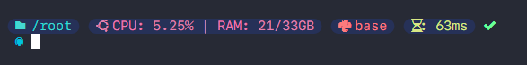
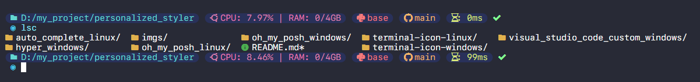
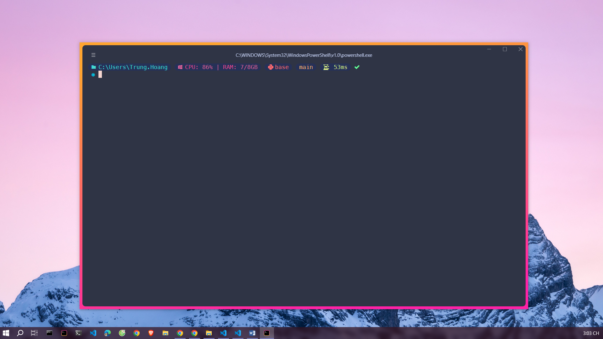

#  <p style="text-align:center"> My Toys </p> 

### 1. Oh My Posh Terminal

- Details at [oh my posh](https://ohmyposh.dev/docs/installation/linux)

- Setup for Linux:
    ```bash
    cd oh_my_posh_linux
    bash oh_my_posh.sh
    ```

- Setup for Windows:
    - [Install here](https://ohmyposh.dev/docs/installation/windows)
    - Open `Windows PowerShell` -> Enter `code $profile` to opne `Microsoft.PowerShell_profile.ps1` -> Insert:
        ```bash
        oh-my-posh.exe init pwsh --config "PATH\multiverse-neon.omp.json" | Invoke-Expression
        ```
        Change `PATH` to current dir, for example:
        ```bash
        oh-my-posh.exe init pwsh --config "D:\personalized_styler\oh_my_posh_windows\multiverse-neon.omp.json" | Invoke-Expression
        ```


### 2. Terminal Icon

- Repository [logo-ls](https://github.com/Yash-Handa/logo-ls)

- Setup for Linux:
    ```bash
    cd terminal_icon_linux
    bash install.sh
    ```
    -> To use: `lsc` or `logo-ls`

- Setup for Windows:
    - Open Windows Powershell
    - Run `Install-Module -Name Terminal-Icons -Scope CurrentUser -Force`
    - Open Microsoft.PowerShell_profile.ps1 by run `code $profile` -> Insert `Import-Module Terminal-Icons`


### 3. Auto Complete for Linux:
- Repository [bleu.sh](https://github.com/akinomyoga/ble.sh)

    ```bash
    cd auto_complete_linux
    bash run_auto_complete.sh
    ```


### 4. Visual Studio Code Customn for Windows - [visual_studio_code_custom_windows](./visual_studio_code_custom_windows)


### 5. Hyper Terminal for Windows
<!--  -->
 

- Details at [hyper.is](https://hyper.is/)

- [Install here](https://hyper.is/#installation)

- Config:
    - Go to `Preferences...`

        

    - Copy the content from the [.hyper.js](./hyper_windows/.hyper.js) file and paste it into the config window.

    - Reload hyper window.