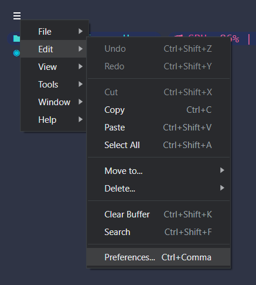

#  <p style="text-align:center"> My Toys </p> 

### 1. Oh My Posh Terminal

- Detail at [oh my posh](https://ohmyposh.dev/docs/installation/linux)

- Setup for linux:
    ```bash
    cd oh_my_posh_linux
    bash oh_my_posh.sh
    ```

- Setup for windows:
    - [Install here](https://ohmyposh.dev/docs/installation/windows)
    - Open `Windows PowerShell` -> Enter `code $profile` to opne `Microsoft.PowerShell_profile.ps1` -> Insert:
        ```bash
        oh-my-posh.exe init pwsh --config "PATH\multiverse-neon.omp.json" | Invoke-Expression
        ```
        Change `PATH` to current dir, for example:
        ```bash
        oh-my-posh.exe init pwsh --config "D:\personalized_styler\oh_my_posh_windows\multiverse-neon.omp.json" | Invoke-Expression
        ```


### 2. Terminal Icon

- Repository: [logo-ls](https://github.com/Yash-Handa/logo-ls)

- Setup for linux:
    ```bash
    cd terminal-icon-linux
    bash install.sh
    ```

- Setup for windows:
    - Open Windows Powershell
    - Run `Install-Module -Name Terminal-Icons -Scope CurrentUser -Force`
    - Open Microsoft.PowerShell_profile.ps1 by run `code $profile` -> Insert `Import-Module Terminal-Icons`


### 3. Auto Complete for Linux:
- Repository: [bleu.sh](https://github.com/akinomyoga/ble.sh)

```bash
cd auto_complete_linux
bash run_auto_complete.sh
```


### 4. Visual Studio Code Customn for Windows - [visual_studio_code_custom_windows](./visual_studio_code_custom_windows)


### 5. Hyper Terminal for Windows - [hyper_windows](./hyper_windows)
<!--  -->
 \
- Detail at [hyper.is](https://hyper.is/)

- [Install](https://hyper.is/#installation)
- Config:
    - Go to `Preferences...`
        
    - Paste the content from the `.hyper.js` file in the `personalized_styler\hyper_windows` folder.
    - Reload hyper windows.